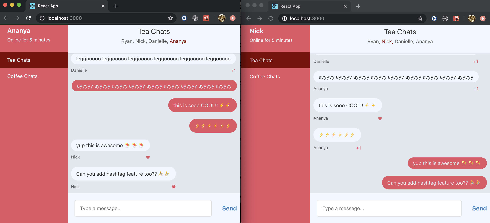

# Install & Run
* Make sure you have `node` installed. This project was tested on Node v12.13.1.
* Run `npm install` in this repo to get your dependencies
* Start the server using `npm run api-server`. Note: Server code was changed a bit to support Server-sent Events [SSE]
* Start the Web Chat Client using `npm start` 
* Unit tests can be run using `npm test`

# Design Considerations

## Use Case 1 - Simple Group Chat
1. Open Chat App in 3 browser tabs.
2. Join each of the 3 tab, with users Ananya, Ryan and Nick respectively. 
3. Make sure all 3 users have the same Group open. Ex: "Tea Chats".
4. Send some test messages from all 3 tabs
5. Now messages from each user will show up for the other users in the chat room.
6. Also notice new message added to the end, with scrolling up.

Screenshot: GroupChat.png

## Use Case 2 - Multiple groups support
1. Open Chat App in 1 browser tab.
2. Select a different group. Ex: "Coffee Chats"
3. Latest messages are rendered for the group

### Backlog?
- Push Notifications for new messages, with Service Worker, when we support HTTPS.
- UX: Supporting large number of users & groups

# Assignment Specifics
* Chat Features - Simple Group Chat with Server-sent Events [SSE]
* Maintainability 
    - Modular React component design with Controller component, Presentation component and React Hooks
    - File structure: Component, style, unit test files are together
    - Used minimal tool for this exercise. But for production code, Webpack, Babel, Less  tools would be necessary
* Testability 
    - Unit test with Jest and React Testing Library
    - Started with a few so far. Production code would need >80% coverage
* UX 
    - Field Validations. Responsive with CSS3 Flexbox
    - Easy to join chat room
    - Snappy message updates for all messages
* Performance considerations 
    - Component Memoization leveraged with React Hooks
    - Component re-rendered only when necessary
    - SSE for lightweight server push, over the same HTTP connection. 
   
    
    
    

